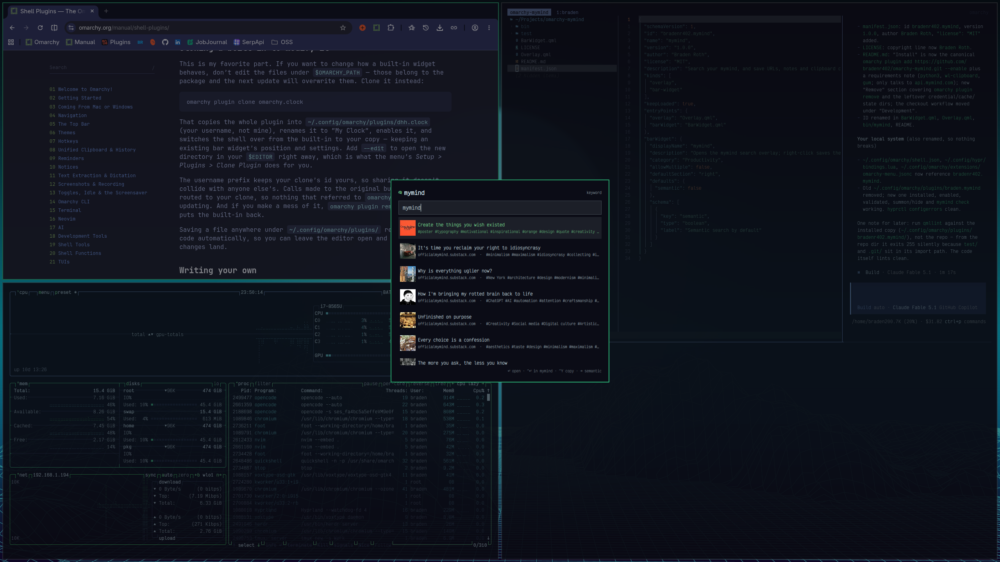

# omarchy-mymind

An [Omarchy](https://omarchy.org) shell plugin for [mymind](https://mymind.com).
Search your mind from a keyboard-first overlay, and save links, notes and
clipboard contents to it without leaving your desktop.

Plugin id: `bradenr402.mymind`



## Features

| Mode | What it does |
|------|--------------|
| **Search** | Type to search (keyword by default, `Tab` toggles semantic). Enter opens the source URL, `Ctrl+Enter` opens the item in mymind, `Ctrl+Y` copies the URL. Thumbnails are fetched lazily and cached. |
| **Save clipboard** | Detects a URL, text, or image on the clipboard and saves it as a link, note, or image. For screenshots: press `PRINT` (Omarchy copies the capture to the clipboard), then save the clipboard. |
| **New note** | Markdown editor; `Ctrl+Enter` saves. |
| **After saving** | Optional follow-up card: add tags, a note, or put the item in a space. Nothing is added by default — `Esc` skips. |
| **Bar widget** | Brain glyph in the bar. Left click: search. Right click: save clipboard. Middle click: new note. |

## Layout

```
manifest.json             Omarchy plugin manifest (overlay + bar-widget)
Overlay.qml               The overlay UI (all modes)
BarWidget.qml             Bar icon + IPC handler
bin/omarchy-mymind         Python 3 (stdlib only) API client: JWT signing, requests, 429 back-off
libexec/setup             Internal integration installer, called by omarchy-mymind setup
libexec/credentials       Internal access-key prompt (writes ~/.config/omarchy-mymind/credentials.json, 0600)
bin/dev-install           Copies the working tree into ~/.config/omarchy/plugins/ and restarts the shell
test/mock_api.py          Fake API server for UI testing without spending credits
test/test_security.py     Offline regression tests for the security properties
```

The QML never touches the network itself; it shells out to `bin/omarchy-mymind`, which
prints one JSON document per API call. That keeps secrets in one place and makes
the CLI useful on its own.

## Install

```bash
omarchy plugin add https://github.com/bradenr402/omarchy-mymind.git --enable
~/.config/omarchy/plugins/bradenr402.mymind/bin/omarchy-mymind setup
```

`omarchy-mymind setup` walks you through the rest:

1. Puts the `omarchy-mymind` command on your PATH (`~/.local/bin`).
2. Stores your access key (see below) if you haven't already.
3. Adds keybindings to `~/.config/hypr/bindings.lua`:
   `Super+Alt+.` search, `Super+Alt+M` save clipboard, `Super+Alt+N` new note.
   Skipped if any of those keys is already bound.
4. Adds *Trigger > mymind* and *Setup > mymind Access Key* to the Omarchy menu.
5. Enables the plugin with the bar widget in the right section.

Setup prompts before adding credentials, keybindings and menu entries. Config
edits live between `omarchy-mymind` marker comments; re-running
`omarchy-mymind setup` refreshes them and `omarchy-mymind setup --uninstall`
removes them. `omarchy-mymind setup --yes` accepts integration defaults but
does not bypass credential entry or replacement confirmation. Without a
terminal, it requires credentials to exist already and otherwise fails before
changing integration. Nothing outside the markers is touched, and no step needs sudo. The
`~/.local/bin` symlinks are only created if the name is free, and only removed
if they still point at this plugin's files; anything else there is left alone.

Requirements: Omarchy 4 (Quattro), `python3` (stdlib only), `wl-clipboard`,
and `gum` for the interactive prompts. The plugin talks only to
`api.mymind.com`, using an access key you supply. Thumbnail redirects are
followed only to `https://*.mymind.com` / `https://*.mymind.host` (its media
CDN) on port 443, or back to the configured API origin, at most 3 hops, and
every response body is capped (8 MiB JSON/images, 64 KiB errors, 60 s per body).

### Access key

Create a key at <https://access.mymind.com/extensions> with **Full access**
(saving needs write); the secret is shown once. `omarchy-mymind setup` stores
it in `~/.config/omarchy-mymind/credentials.json` with mode `0600` and
verifies it with a 1-credit request.

The configuration directory has mode `0700`. `XDG_CONFIG_HOME` overrides the
default `~/.config` base; `MYMIND_CREDENTIALS` overrides the full credentials
file path (also supported by the development mock API).

To create or replace just the access key, run `omarchy-mymind setup --credentials`
in a terminal. This does not change PATH, keybindings, menu entries or plugin
enablement. Replacement always asks for confirmation, even with `--yes`.

The secret never leaves the machine; it is only used to HMAC-sign short-lived
JWTs bound to each request's method and path. It is passed to the writer over
stdin, never as a command-line argument, so it does not appear in
`/proc/*/cmdline`. Note bodies from the overlay take the same stdin path.

Prefer different keys or menu placement? Run `omarchy-mymind setup`, decline
steps 3–4, and copy what you want from `libexec/setup` (`bindings_block` / `menu_block`).

## Summon payloads

`omarchy-shell shell summon bradenr402.mymind '<json>'`

| Field | Values |
|-------|--------|
| `mode` | `search` (default), `save`, `note` |
| `query` | Pre-fill the search box (`search` mode) |
| `text` | Pre-fill the editor (`note` mode) |

IPC shortcuts via the bar widget: `omarchy-shell bradenr402.mymind search|save|note`.

## CLI

`setup` prints human-readable output and requires a terminal for prompts.
API commands print JSON. `--credentials` and `--uninstall` are mutually exclusive.

```
omarchy-mymind setup
omarchy-mymind setup --credentials
omarchy-mymind setup --yes
omarchy-mymind setup --uninstall
omarchy-mymind check
omarchy-mymind search "design tools" [--semantic] [--limit 20]
omarchy-mymind save-url <url> [--title T] [--tag t]... [--note MD] [--space ID]...
omarchy-mymind save-note "<markdown>"          # or via stdin
omarchy-mymind save-file <path>
omarchy-mymind save-clipboard
omarchy-mymind spaces
omarchy-mymind add-tags <id> tag [tag...]
omarchy-mymind add-note <id> "<markdown>"
omarchy-mymind add-to-space <id> <spaceId>
omarchy-mymind thumbnail <id> [--size 96x96]
omarchy-mymind open <id> [--app]
```

Rate limits: after a `429` the CLI records the reset time in
`~/.local/state/omarchy-mymind/backoff.json` and refuses to call the API until
it passes (`omarchy-mymind clear-backoff` overrides). Costs are surfaced in the overlay
footer.

## Remove

```bash
omarchy-mymind setup --uninstall
omarchy plugin remove bradenr402.mymind
```

The first line removes the CLI symlink, keybindings and menu entries. In a
terminal, it also asks whether to delete the saved credentials at the displayed
path, defaulting to **No**. `--yes` never approves credential deletion; without
a terminal, credentials are always kept. Only the selected file is removed
(a symlink is unlinked, not its target); directories, sibling files, caches and
state are left alone. Deleting the file does not revoke the API key; revoke
it at <https://access.mymind.com/extensions> if needed.

The second command removes the plugin itself. Omarchy's removal command does
not run our cleanup or show the credentials prompt, so use the order above.
For a clean slate, you can additionally remove this plugin's data directories:

```bash
rm -rf ~/.config/omarchy-mymind ~/.cache/omarchy-mymind ~/.local/state/omarchy-mymind
```

## Development

```bash
git clone https://github.com/bradenr402/omarchy-mymind.git ~/Projects/omarchy-mymind
cd ~/Projects/omarchy-mymind
bin/dev-install
~/.config/omarchy/plugins/bradenr402.mymind/bin/omarchy-mymind setup
```

```bash
bin/dev-install            # sync + restart shell (QML is cached; a restart is required for QML edits)
NO_RESTART=1 bin/dev-install   # sync only (enough for bin/ changes)
bin/dev-install --watch    # resync on every save
omarchy plugin validate .  # manifest/structure check
journalctl --user -f -o cat | grep -i mymind
```

To exercise the UI without spending credits, run `python3 test/mock_api.py`
and add `"apiUrl": "http://127.0.0.1:8765"` to your credentials file (any
kid/secret pair works with the mock). Remove it afterwards. If a mock serves
thumbnails from a different origin, allow it with
`MYMIND_THUMBNAIL_HOSTS=host:port`.

`python3 test/test_security.py` runs the offline regression suite for the
security properties above (secret handling, symlink safety, bounded network
reads, redirect validation) against throwaway HOME/XDG dirs.

## Notes / limitations

- mymind's API content scope is not yet enforced; any key can see everything.
- Search costs 10–250 credits per query plus 1–250 for fetching the matching
  objects; the overlay debounces input by 350 ms to limit spend.
- Objects can carry many notes via the API but the mymind app currently shows
  only the first.
- Thumbnails cost 1 credit each (cached on disk in `~/.cache/omarchy-mymind`).

## License

MIT
